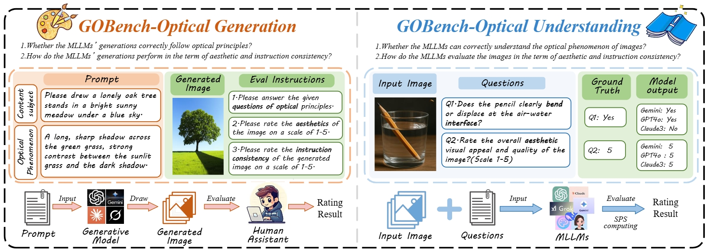
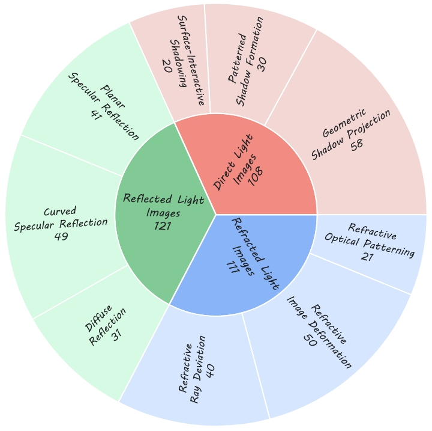
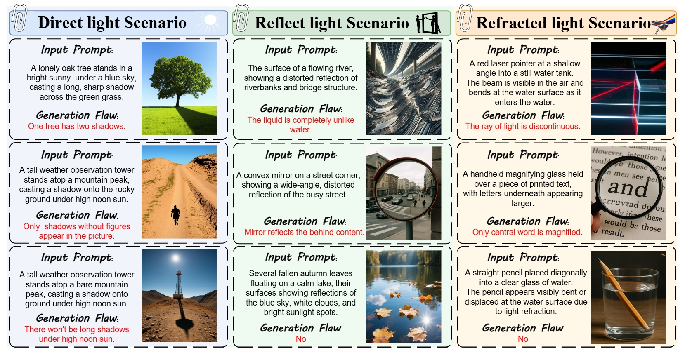
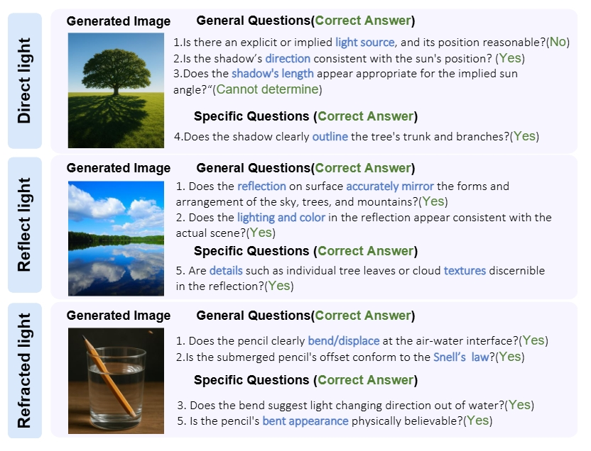
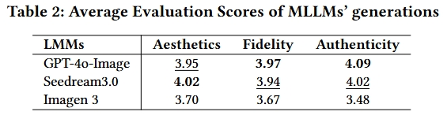
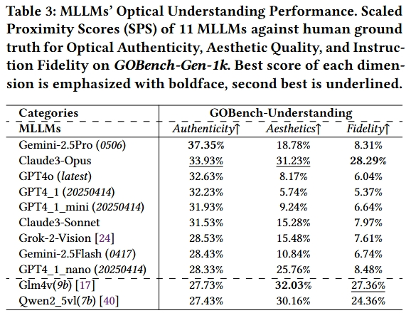
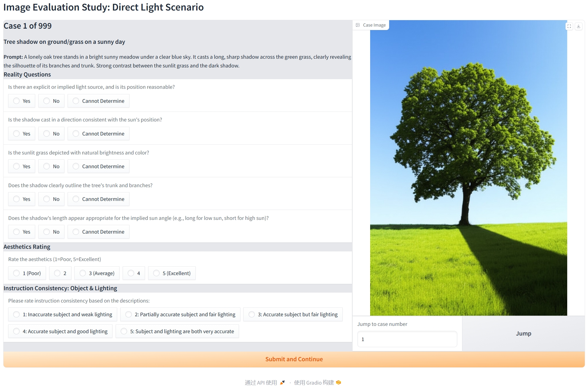
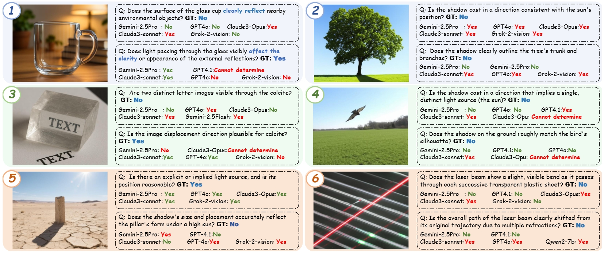

<div align="center">
  
# GOBench: Benchmarking Geometric Optics Generation and Understanding of MLLMs
  
Xiaorong Zhu,  Ziheng Jia, Jiarui Wang, Xiangyu Zhao, Haodong Duan,Xiongkuo Min,Jia Wang,Zicheng Zhang,Guangtao Zhai

[](https://huggingface.co/datasets/bonnot/GOBench)

</p>
</div>
<div align="center">
  
</div>

In this work, we propose **GOBench**, the first benchmark on emerging abilities of MLLMs on geometric optical generation and understanding. On the left side, GOBench-Optical Generation is to judge the MLLM's generations, termed as GOBench-Gen-1k, whether follow optical principles; on the right side, GOBench-Optical Understanding is to judge if MLLMs can correctly understand the optical phenomenon of images

## 📖 Introduction

<div align="center">
  
  <br>
</div>

Task Distribution of *GOBench-Gen-1K*, involves three main optical categories: Direct light, Reflect light, and Refracted light. Each category includes various subcategories, facilitating a comprehensive dataset.

</div>
<div align="center">
  
</div>

Examples of *GOBench-Gen-1k* that show cases of designed scenarios, including direct light scenario, reflect light scenario and refracted light scenario. Each case includes the input prompt, and the output image generated by state-of-art MLLM. The red words represent the obvious flaws of the MLLM's generations that violating optical or basic physical principles.

</div>
<div align="center">
  
</div>

**Optical Authenticity questions of GOBench**. The questions based on *GOBench-Gen-1k* that evaluates the Optical Authenticity of MLLM's generations, and each case contains general and specific questions. 

**GOBench aims to provide a standardized and challenging benchmark to drive future research towards MLLMs capable of generating and comprehending physically plausible visual content.**

## 🔥 Benchmark Performance

Our evaluations with **GOBench** reveal critical insights into the current limitations of MLLMs in handling geometric optics.

<div align="center">
  
  <br>
</div>

<div align="center">
  
  <br>
</div>

## 🛠️ Quick Start

### 1. Output Generation
The examples of images for the three categories are located in the [`data`](data) directory. The total images can be downloaded in [](https://huggingface.co/datasets/bonnot/GOBench). Each sample in the dataset contains `generation prompts`, the associated `image` and the associated `authentic questions`. 

### 2. Evaluation By Human
Once all outputs are generated and saved in the specified format, you can evaluate them using the `human_rate.py` script. The human subjective experiment rating interface is shown below.

</div>
<div align="center">
  
</div>

### 3. Evaluation By Gemini
Once all outputs are generated and saved in the specified format, you can evaluate them using the `Gemini2.5.py` script.

#### Step 1: Configure API Settings
Open the `Gemini2.5.py` file and update the following parameters with your OpenAI credentials:
- `api_key`: Your API key.
- `api_base`: YourAPI base URL (if applicable).

#### Step 2: Run the Evaluation Script
Execute the script using the following command:(You can change the api to use the other MLLMs)
```bash
python Gemini2.5.py --input data/data_total.json --output outputs/{MODEL_NAME}
```

#### Step 3: Review the Results
After running the script, result files will be generated in the `outputs/{MODEL_NAME}` directory:

## 🛠️ Quick Start from VLMEvalKit
Also, our work has been merged to the VLMEvalKit at https://github.com/Amber0614/VLMEvalKit/tree/GOBench;
You can download the VLMEvalKit from here, and use the following commound to evaluate various LMMs:
```bash
python run.py --model Qwen2.5-VL-7B-Instruct --data GOBench --verbose
```

## 🔥 Outputs of Current Models
We exhibit some examples of output of MLLMs. For more details, please refer to our paper.

<div align="center">
  
</div>
