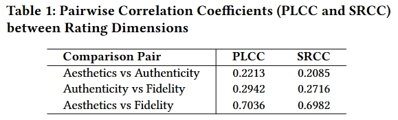

<div align="center">
  
# GOBench: Benchmarking Geometric Optics Generation and Understanding of MLLMs
  
Xiaorong Zhu,  Ziheng Jia, Jiarui Wang, Xiangyu Zhao, Haodong Duan,Xiongkuo Min,Jia Wang,Zicheng Zhang,Guangtao Zhai

[](https://huggingface.co/datasets/bonnot/GOBench)

</p>
</div>
<div align="center">
  
</div>

## 📖 Introduction

<div align="center">
  
  <br>
  <em>(Illustration of GOBench's two core evaluation tasks: Generation and Understanding.)</em>
</div>

In this work, we introduce \textbf{GOBench}, the first benchmark to systematically evaluate MLLMs' ability across two tasks: 1) \textbf{Generating Optically Authentic Imagery} and 2) \textbf{Understanding Underlying Optical Phenomena}. We curates high-quality prompts of geometric optical scenarios and use MLLMs to construct GOBench-Gen-1k dataset. We then organize subjective experiments to assess the generated imagery based on \textit{Optical Authenticity}, \textit{Aesthetic Quality}, and \textit{Instruction Fidelity}, revealing MLLMs' generation flaws that violate optical principles. For the understanding task, we apply crafted evaluation instructions to test optical understanding ability of eleven prominent MLLMs. 
The experimental results demonstrate that current models face significant challenges in both optical generation and understanding. The top-performing generative model, GPT-4o-Image, cannot perfectly complete all generation tasks, and the best-performing MLLM model, Gemini-2.5Pro, attains a mere 37.35\% accuracy in optical understanding.

</div>
<div align="center">
  
</div>

</div>
<div align="center">
  
</div>

</div>
<div align="center">
  
</div>


To address this critical gap, we introduce **GOBench**, the first benchmark to systematically evaluate MLLMs' ability across two distinct tasks:
1.  **Generating Optically Authentic Imagery**: Assessing MLLMs' proficiency in creating images that adhere to geometric optical principles.
2.  **Understanding Underlying Optical Phenomena**: Evaluating MLLMs' comprehension of optical concepts and their implications within visual contexts.

To construct this benchmark, we meticulously curated high-quality prompts describing various geometric optical scenarios. Using these prompts, we generated the **GOBench-Gen-1k dataset** through prominent MLLMs. For the generation task, we organized subjective experiments (or leverage LMM-as-a-Judge, as per your code) to rigorously assess the generated imagery based on three crucial criteria:
*   ***Optical Authenticity***: Does the image accurately reflect real-world optical phenomena (e.g., correct reflections, refractions, shadows)?
*   ***Aesthetic Quality***: Is the overall visual appearance and composition of the image appealing?
*   ***Instruction Fidelity***: How well does the generated image align with the given textual prompt instructions?

This process allowed us to reveal prevalent flaws in MLLMs' generation that violate fundamental optical principles. For the understanding task, we applied specially crafted evaluation instructions to test the optical comprehension ability of **eleven prominent MLLMs**.

Our experimental results demonstrate that current models, including state-of-the-art MLLMs, face significant challenges in both optical image generation and understanding. Notably, the top-performing generative model, **GPT-4o-Image**, cannot perfectly complete all generation tasks, exhibiting inconsistencies in optical authenticity. Furthermore, **Gemini-2.5Pro**, identified as the best-performing MLLM model in optical understanding, attained a mere **37.35% accuracy**.

**GOBench aims to provide a standardized and challenging benchmark to drive future research towards MLLMs capable of generating and comprehending physically plausible visual content.**

## 🔥 Benchmark Performance

Our evaluations with **GOBench** reveal critical insights into the current limitations of MLLMs in handling geometric optics.

</div>
<div align="center">
  
</div>

<div align="center">
  
  <br>
  <em>(Accuracy scores for MLLMs on the optical understanding task.)</em>
</div>

<div align="center">
  
  <br>
  <em>(Accuracy scores for MLLMs on the optical understanding task.)</em>
</div>

**Key Findings:**
-   **Generation Flaws:** Despite high-quality prompts, generative MLLMs frequently produce images that violate fundamental optical laws (e.g., incorrect reflections, inconsistent shadows, implausible refractions).
-   **Limited Understanding:** Even leading MLLMs struggle with basic optical reasoning questions, highlighting a gap in their physical world comprehension.
-   **Top Models Still Imperfect:** While models like GPT-4o-Image and Gemini-2.5Pro show promising capabilities, they are far from achieving satisfactory performance in complex optical scenarios.

## 🛠️ Quick Start

### 1. Output Generation
The input images for the four categories are located in the [`data`](data) directory. Each sample in the dataset contains an `instruction` and an associated `image`. You can use these inputs to generate the corresponding output image.

### 2. Evaluation By Human
Once all outputs are generated and saved in the specified format, you can evaluate them using the `gpt_eval.py` script.

</div>
<div align="center">
  
</div>

### 3. Evaluation By Gemini
Once all outputs are generated and saved in the specified format, you can evaluate them using the `gpt_eval.py` script.

#### Step 1: Configure API Settings
Open the `gpt_eval.py` file and update the following parameters with your OpenAI credentials:
- `api_key`: Your OpenAI API key.
- `api_base`: Your OpenAI API base URL (if applicable).

#### Step 2: Run the Evaluation Script
Execute the script using the following command:
```bash
python gpt_eval.py --input data/data_total.json --output outputs/MODEL_NAME
```

#### Step 3: Review the Results
After running the script, three result files will be generated in the `outputs/{MODEL_NAME}` directory:

## 🔥 Outputs of Current Models
We exhibit some outputs of the five models in the appendix. For more details, please refer to our paper.

<div align="center">
  
</div>
